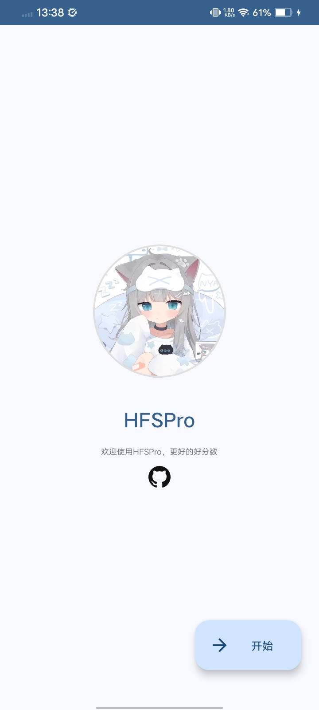
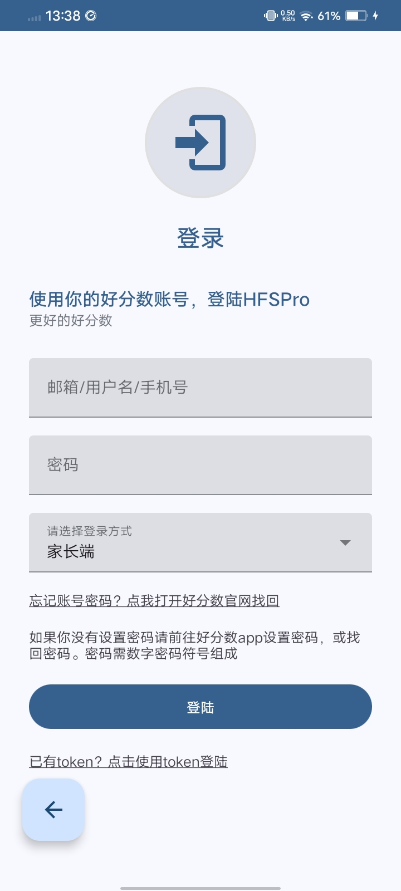
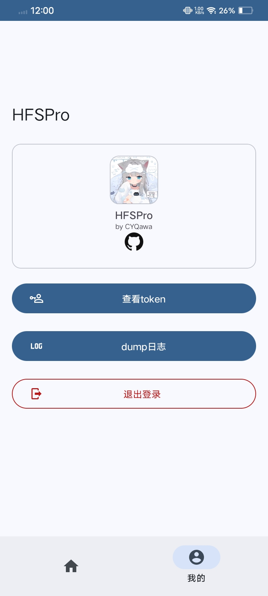
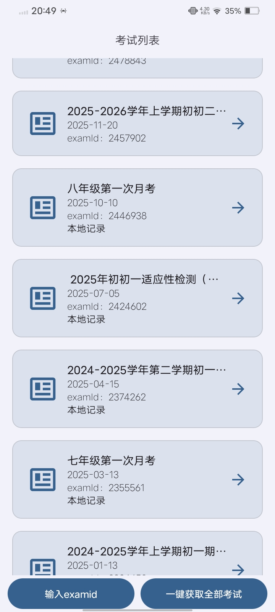
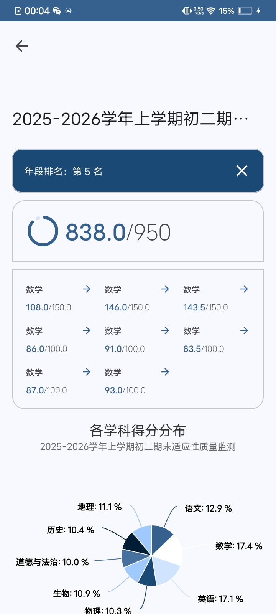
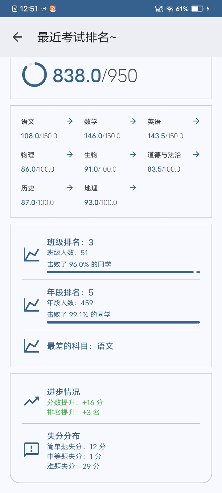

**❤️注意 : 还在开发，未开发完成**

  

<h1 align="center"HFSPro</h1>

  <strong>🎨 一个第三方好分数客户端 HFSPro</strong>

  

HFSPro 是一个为「好分数」平台开发的第三方、现代化、功能增强的 Android 客户端。它旨在提供比官方应用更清爽、更高效、更专注的体验。

> **⚠️ 重要声明**
> 1. HFSPro 是一个非官方、第三方的客户端。
> 2. 开发目的： 方便,快捷,优雅的看成绩，不再用囊肿的好分数客户端
> 3. 数据安全： 所有登录、数据请求均直接与好分数官方服务器通信，仅存储本地token用于请求
> 4. 我是初中生，写的不好请见谅

## ✨ 主要特性

*   **🌙 纯净无广告**：移除官方应用中的广告和冗余内容
*   **🎨 现代化界面**：采用Material Design 3设计语言
*   **😏 查看排名**：好分数没删干净的排名接口😋
*   **✍️ 查看超过120天的考试**：一键获取全部考试

---

## 📱 预览截图

  
  
  
  
  
  

## 📥 下载与安装

下载 APK 文件

1. 前往本项目的 "Release" (https://github.com/CYQawa/HFSPro/releases) 页面。
2. 下载最新版本的 "HFSPro_xxx.apk" 文件。
3. 在 Android 设备上找到并点击该文件进行安装。
4. （如遇阻止）根据系统提示，开启“允许来自此来源的应用”安装权限。

## 🚀 使用方法

1. 安装 HFSPro。
2. 打开应用，使用你的好分数账号登录。
3. 用吧

## ⚠️ 隐私声明

需要使用你的好分数账号密码登录获取token，不存储账号密码，会在本地存储你的token用于请求。所有网络请求均与好分数官方api交互